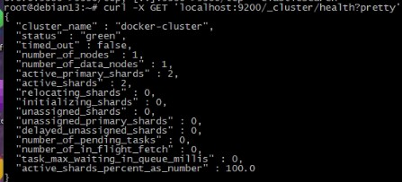
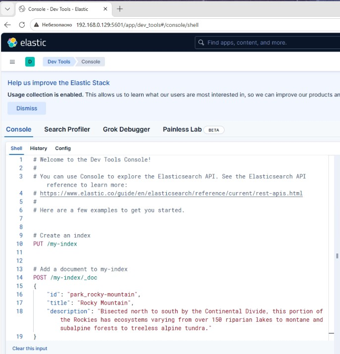
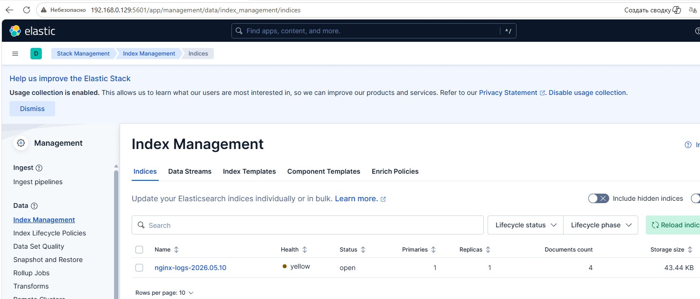
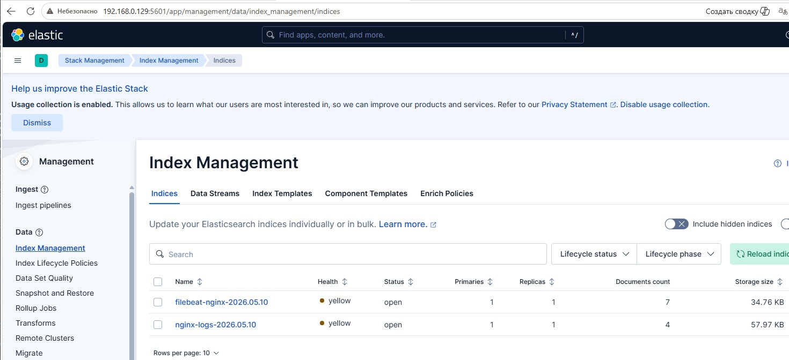

### Домашнее задание ELK - Князев Евгений

# Задание 1. Elasticsearch
Приведите скриншот команды 'curl -X GET 'localhost:9200/_cluster/health?pretty', сделанной на сервере с установленным Elasticsearch. Где будет виден нестандартный cluster_name.

# Задание 2. Kibana
Приведите скриншот интерфейса Kibana на странице http://<ip вашего сервера>:5601/app/dev_tools#/console, где будет выполнен запрос GET /_cluster/health?pretty.

# Задание 3. Logstash
Приведите скриншот интерфейса Kibana, на котором видны логи Nginx.

# Задание 4. Filebeat
Приведите скриншот интерфейса Kibana, на котором видны логи Nginx, которые были отправлены через Filebeat.
